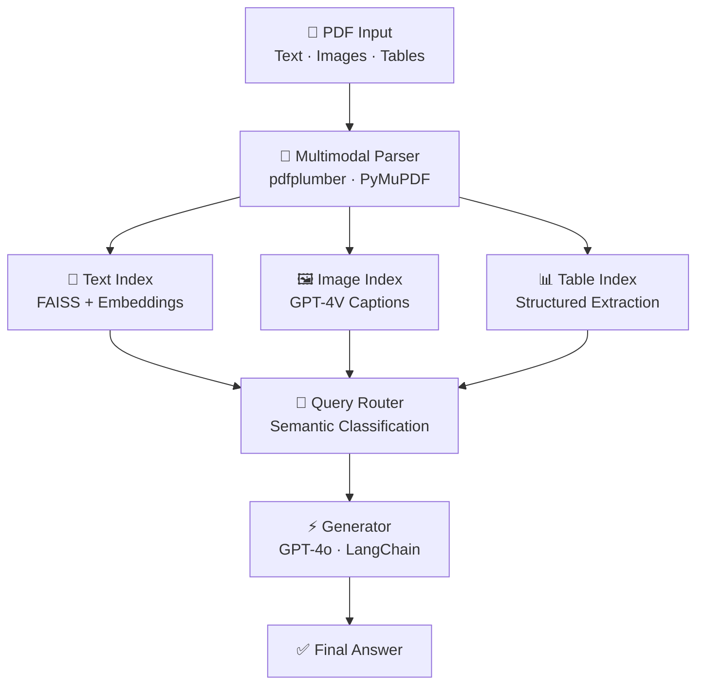

<div align="center">


<p>
  <a href="https://www.linkedin.com/in/mohit-b-9a997b301/">
    
  </a>
  <a href="https://x.com/mohitkb22">
    
  </a>
  <a href="mailto:mohitbarse2230@gmail.com">
    
  </a>
</p>

</div>

---

## About me

I'm an AI/ML engineer focused on building **retrieval-augmented generation systems** and **multimodal AI applications** that work reliably in production — not just in notebooks.

My work sits at the intersection of LLM engineering, backend systems, and applied ML. I care about the full pipeline: from data ingestion and vector indexing to API deployment and output quality.

- Currently deepening expertise in **MLOps**, **FastAPI** deployment patterns, and model evaluation
- Building toward owning end-to-end AI pipelines — data in, intelligent output out
- Occasionally sharing engineering thoughts on **[@mohitkb22](https://x.com/mohitkb22)**

---

## Tech stack

**Core languages:** Python · JavaScript

**AI / LLM:** LangChain · OpenAI API (GPT-4o, GPT-4V) · FAISS · Embeddings · Prompt engineering

**ML / Data:** TensorFlow · Keras · scikit-learn · OpenCV · Pandas · Plotly

**Backend & infra:** FastAPI · PostgreSQL · Docker · Git

---

## Projects

### [Multimodal RAG Engine](https://github.com/MohitKB22/rag-multimodal-engine)

A production-oriented RAG system that ingests PDFs containing mixed content — text, images, and tables — and answers queries by routing them to the right modality index.

```
PDF → Multimodal Parser → [Text Index | Image Index | Table Index]
                                          ↓
                              Query Router → GPT-4o → Answer
```

**Key design choices:**
- Separate FAISS indexes per modality (text embeddings vs. GPT-4V-generated image captions vs. structured table extraction)
- Semantic query classifier routes each question to the most relevant index before generation
- Built with `LangChain` · `FAISS` · `pdfplumber` · `PyMuPDF` · `GPT-4o`

---

### [Stock Analytics Hub](https://github.com/MohitKB22/stock-analytics-hub)

Interactive dashboard for Nifty and equity market data — real-time visualization, trend analysis, and pattern detection.

Built with `Python` · `Streamlit/Dash` · `Pandas` · `Plotly`

---

### [Care AI Engine](https://github.com/MohitKB22/care-ai-engine)

Conversational AI for healthcare — symptom intake, intelligent triage routing, and patient-facing Q&A.

Built with `JavaScript` · NLP · AI APIs

---

### [Fingerprint Blood Group Prediction](https://github.com/MohitKB22/Fingerprint-Based-BloodGroup-Prediction)

End-to-end CNN pipeline predicting blood group from fingerprint images — from raw image preprocessing through classification. A research-oriented deep learning project exploring biometric correlates.

Built with `Python` · `TensorFlow/Keras` · `OpenCV`

---

## Architecture — Multimodal RAG



---

## GitHub stats

<div align="center">


</div>

---

## Get in touch

| | |
|---|---|
| LinkedIn | [mohit-b-9a997b301](https://www.linkedin.com/in/mohit-b-9a997b301/) |
| X | [@mohitkb22](https://x.com/mohitkb22) |
| Email | [mohitbarse2230@gmail.com](mailto:mohitbarse2230@gmail.com) |

---

<div align="center">

</div>
