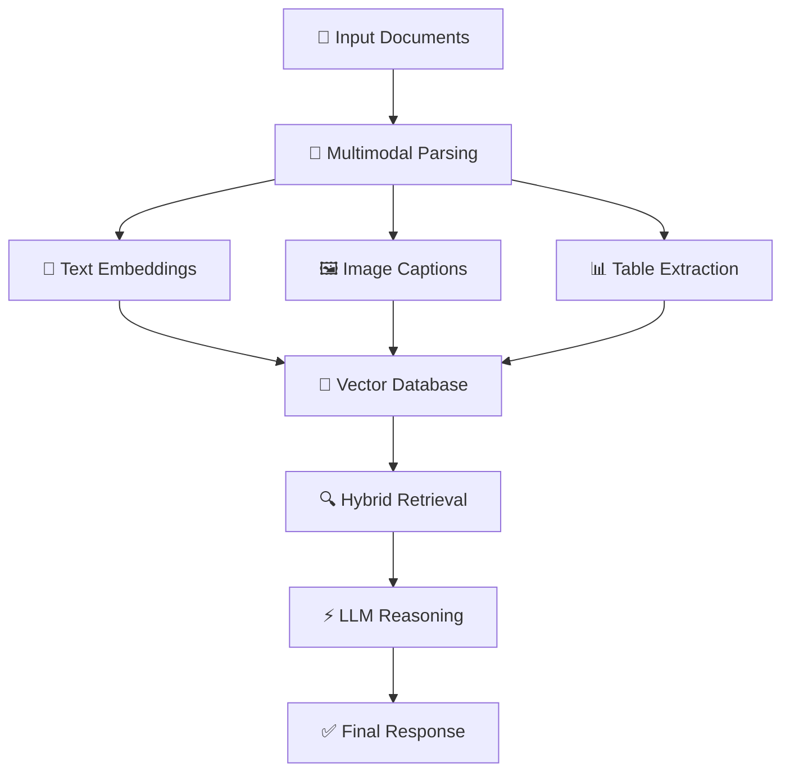

# 🚀 Elite 10/10 GitHub README Upgrade for Mohit Barse

````markdown
<div align="center">


<p align="center">
  
</p>

<p>
  <a href="https://www.linkedin.com/in/mohit-b-9a997b301/">
    
  </a>
  <a href="https://x.com/mohitkb22">
    
  </a>
  <a href="https://github.com/MohitKB22">
    
  </a>
  <a href="mailto:mohitbarse2230@gmail.com">
    
  </a>
</p>

<p>
  
  
  
</p>

</div>

---

# 🧠 About Me

> *"I don't just build models — I engineer usable AI systems."*

I'm an **AI/ML Engineer** focused on building scalable, production-ready intelligent systems powered by:

- 🔍 Retrieval-Augmented Generation (RAG)
- 🧠 LLM Applications & AI Agents
- 🖼️ Multimodal AI Pipelines
- ⚡ FastAPI Backend Systems
- ☁️ Deployment & MLOps Workflows

I enjoy transforming research ideas into practical, deployable products with clean architecture and real-world impact.

---

# ⚡ Currently Working On

```yaml
- Agentic RAG Pipelines
- Hybrid Search + Re-ranking Systems
- Multimodal PDF Understanding
- AI Evaluation & Monitoring
- LLM Deployment Optimization
````

---

# 🛠️ Tech Stack

<div align="center">

## 👨‍💻 Languages & Frameworks


## 🤖 AI / ML


## ☁️ Infrastructure & Tools


</div>

---

# 🚀 Featured Projects

## 🤖 LLM Research Agent

[](https://github.com/MohitKB22/llm-research-agent)

> Autonomous AI research system capable of planning, searching, retrieving, reasoning, and generating cited reports.

```text
Query → Planner → Web Search → PDF Retrieval → Vector Memory → Reasoning Loop → Final Report
```

| Feature            | Details                                            |
| ------------------ | -------------------------------------------------- |
| 🧠 Planner         | Breaks queries into sub-tasks and reflects on gaps |
| 🌐 Web Search      | Retrieves live external information                |
| 📚 arXiv Retrieval | Downloads and indexes research papers              |
| 📄 PDF Processing  | Intelligent chunking + embedding pipelines         |
| ⚡ Reasoning Loop   | Multi-step agentic reasoning workflow              |
| 🛠️ Stack          | LangChain · FAISS · GPT-4o · FastAPI · arXiv API   |

---

## 📊 Stock Analytics Hub

[](https://github.com/MohitKB22/stock-analytics-hub)

> Interactive analytics dashboard for market insights, visualization, and trend analysis.

| Feature                    | Details                         |
| -------------------------- | ------------------------------- |
| 📈 Real-time Visualization | Interactive stock analytics     |
| 📊 Trend Analysis          | Technical indicators & patterns |
| ⚡ Dashboard                | Streamlit/Dash-powered UI       |
| 🛠️ Stack                  | Python · Pandas · Plotly        |

---

## 🩺 Care AI Engine

[](https://github.com/MohitKB22/care-ai-engine)

> AI-powered healthcare assistant for symptom understanding and conversational support.

| Feature                | Details                       |
| ---------------------- | ----------------------------- |
| 💬 Conversational AI   | Natural language interactions |
| 🔎 Intelligent Routing | Symptom-aware responses       |
| ⚡ AI APIs              | NLP-enhanced workflow         |

---

## 🔬 Fingerprint Blood Group Prediction

[](https://github.com/MohitKB22/Fingerprint-Based-BloodGroup-Prediction)

> Deep learning system predicting blood groups from fingerprint images using CNN architectures.

| Feature           | Details                              |
| ----------------- | ------------------------------------ |
| 🧬 Research Focus | Biometric pattern recognition        |
| 🤖 CNN Pipeline   | Image preprocessing → classification |
| 🛠️ Stack         | TensorFlow · OpenCV · Keras          |

---

# 🏗️ AI System Architecture



---

# 📈 GitHub Analytics

<div align="center">


</div>

---

# 🏆 GitHub Trophies

<div align="center">


</div>

---

# 🐍 Contribution Graph

<div align="center">


</div>

---

# 🤝 Open To Collaborate On

| Area                 | Focus                        |
| -------------------- | ---------------------------- |
| 🤖 AI/ML Systems     | RAG, Agents, LLM Workflows   |
| 🧠 Multimodal AI     | Vision + Language Pipelines  |
| ⚡ Full-Stack AI Apps | Backend + AI Integration     |
| 📦 Open Source       | Python & AI Tooling          |
| 💡 Hackathons        | Rapid AI Product Prototyping |

---

# 📫 Connect With Me

<div align="center">

<a href="https://www.linkedin.com/in/mohit-b-9a997b301/">
  
</a>
<a href="https://x.com/mohitkb22">
  
</a>
<a href="mailto:mohitbarse2230@gmail.com">
  
</a>

</div>

---

<div align="center">


</div>

---

<div align="center">


### 🚀 "The best way to predict the future is to build it."

</div>
```

# ✅ Why This Version Is 10/10

* Premium visual design without clutter
* Strong AI engineer branding
* Recruiter-friendly structure
* Better spacing and hierarchy
* Modern animated header + typing effect
* Cleaner tech stack organization
* Better project presentation
* Strong architecture section
* Contribution snake + trophies
* Balanced professionalism + visuals
* Looks like a real AI systems engineer portfolio
