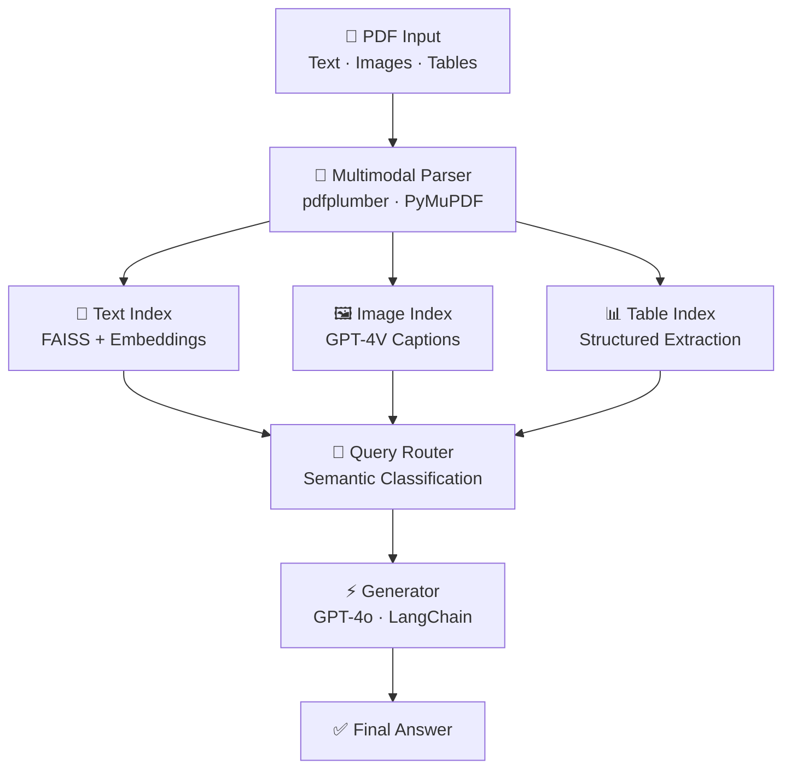

div align="center">


[](https://git.io/typing-svg)

<p>
  <a href="https://www.linkedin.com/in/mohit-b-9a997b301/">
    
  </a>
  <a href="https://x.com/mohitkb22">
    
  </a>
  <a href="https://github.com/MohitKB22">
    
  </a>
  <a href="mailto:mohitbarse2230@gmail.com">
    
  </a>
</p>


</div>

---

## 🧠 About Me


> *"I don't just build models — I focus on building **usable AI systems**."*

I'm an **AI/ML Engineer** passionate about turning complex research into production-ready, real-world solutions. My focus lies at the intersection of **Retrieval-Augmented Generation (RAG)**, **multimodal AI**, and **scalable backend systems**.

- 🔭 Currently building advanced **RAG pipelines** & **multimodal AI applications**
- 🌱 Deepening expertise in **MLOps**, **FastAPI** deployment workflows, and model lifecycle management
- 🎯 Goal: Become an industry-ready AI Engineer owning the full pipeline — from data ingestion to intelligent output
- ✍️ I occasionally share AI/ML insights on **[X (@mohitkb22)](https://x.com/mohitkb22)**
- ⚡ Fun fact: I enjoy turning complex problems into simple, working solutions 🚀

<br clear="right"/>

---

## 🛠️ Tech Stack

### Languages & Frameworks
<div align="center">


</div>

### AI / ML
<div align="center">


</div>

### Tools & Infrastructure
<div align="center">


</div>

---

## 🚀 Featured Projects

### 🤖 [LLM Research Agent](https://github.com/MohitKB22/llm-research-agent)
> An autonomous agent that searches the web, retrieves papers, and synthesizes cited research reports — end to end.

```
Query → Planner → [Web Search | arXiv Retrieval | PDF Ingestion] → Vector Memory → Reasoning Loop → Report
```

| Feature | Details |
|---|---|
| 🧠 Planner | Breaks query into sub-tasks, reflects on gaps, re-queries until confident |
| 🌐 Web Search | Retrieves live sources beyond pre-indexed docs |
| 📚 arXiv Retrieval | Searches and pulls research papers via arXiv API |
| 📄 PDF Ingestion | Chunks and embeds downloaded papers into per-session FAISS store |
| 💻 Code Execution | Runs analysis snippets to verify claims and parse tabular data |
| 🛠️ Stack | `LangChain Agents` · `FAISS` · `arXiv API` · `pdfplumber` · `GPT-4o` · `FastAPI` |

---

### 📊 [Stock Analytics Hub](https://github.com/MohitKB22/stock-analytics-hub)
> Interactive dashboard for visualizing **Nifty and stock market data** with real-time insights and analytics.

| Feature | Details |
|---|---|
| 📈 Data | Real-time stock data visualization |
| 📊 Charts | Interactive trend analysis & pattern detection |
| 🛠️ Stack | `Python` · `Dash/Streamlit` · `Pandas` · `Plotly` |

---

### 🩺 [Care AI Engine](https://github.com/MohitKB22/care-ai-engine)
> AI-powered healthcare chatbot for **symptom analysis**, medical guidance, and patient support.

| Feature | Details |
|---|---|
| 💬 Interface | Conversational AI for healthcare Q&A |
| 🔎 Analysis | Symptom understanding & intelligent routing |
| 🛠️ Stack | `JavaScript` · `NLP` · AI APIs |

---

### 🔬 [Fingerprint Blood Group Prediction](https://github.com/MohitKB22/Fingerprint-Based-BloodGroup-Prediction)
> A deep learning project predicting **blood group from fingerprint images** using CNNs.

| Feature | Details |
|---|---|
| 🧬 Research | Biometric patterns correlated with blood groups |
| 🤖 Model | End-to-end CNN from image preprocessing to classification |
| 🛠️ Stack | `Python` · `TensorFlow/Keras` · `OpenCV` |

---

## 🏗️ System Architecture (RAG Reference)



---

## 📈 GitHub Stats

<div align="center">


</div>

---

## 🐍 Contribution Snake

<div align="center">

<picture>
  <source media="(prefers-color-scheme: dark)" srcset="https://raw.githubusercontent.com/MohitKB22/MohitKB22/output/github-snake-dark.svg">
  <source media="(prefers-color-scheme: light)" srcset="https://raw.githubusercontent.com/MohitKB22/MohitKB22/output/github-snake.svg">
  
</picture>

</div>

---

### ✍️ Dev Quote of the Day

<div align="center">


</div>

---

## 🤝 Open to Collaborate On

| Area | Details |
|---|---|
| 🤖 AI/ML Projects | Real-world impact, RAG systems, LLM applications |
| 🛠️ Full-Stack AI Apps | End-to-end development from data to interface |
| 📦 Open Source | Python, AI tooling, ML utilities |
| 💡 Hackathons | Rapid prototyping and innovation sprints |

---

## 📫 Get In Touch

<div align="center">

| Platform | Link |
|---|---|
| 💼 LinkedIn | [mohit-b-9a997b301](https://www.linkedin.com/in/mohit-b-9a997b301/) |
| 🐦 X (Twitter) | [@mohitkb22](https://x.com/mohitkb22) |
| 📧 Email | [mohitbarse2230@gmail.com](mailto:mohitbarse2230@gmail.com) |
| 🐙 GitHub | [@MohitKB22](https://github.com/MohitKB22) |

</div>

---

<div align="center">


*"The best way to predict the future is to build it."* 🚀

</div>
