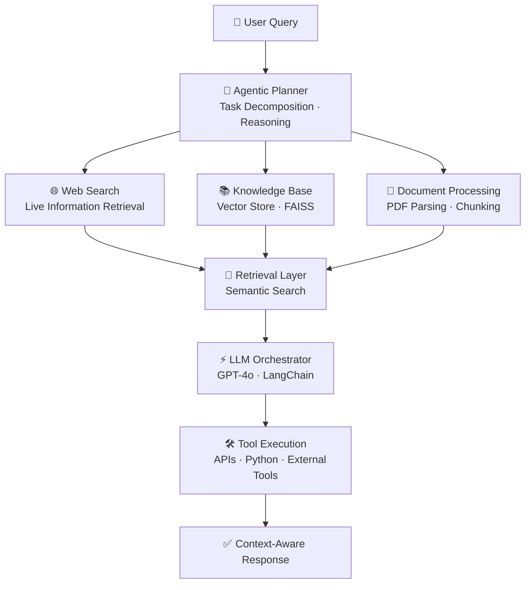

 

---

## 🌐 Connect With Me

---

## 🧠 About Me

> *"I don't just build models — I focus on building **usable AI systems**."*

I'm an **AI/ML Engineer** passionate about transforming cutting-edge research into production-ready, real-world solutions. My expertise sits at the intersection of **Retrieval-Augmented Generation (RAG)**, **multimodal AI**, and **scalable backend systems**.

- 🔭 Currently building advanced **RAG pipelines** & **multimodal AI applications**
- 🌱 Deepening expertise in **MLOps**, **FastAPI** deployment workflows, and model lifecycle management
- 🎯 Goal: Own the full AI pipeline — from data ingestion to intelligent, deployed output
- ✍️ Sharing AI/ML insights and engineering thoughts on **[X (@mohitkb22)](https://x.com/mohitkb22)**
- 💼 Open to **full-time roles**, **freelance AI projects**, and **research collaborations**
- ⚡ Fun fact: I turn complex problems into simple, working solutions 🚀

 

---
## 🧠 Tech Stack

### 👨‍💻 Programming Languages

### 🤖 AI / ML Frameworks

### ☁️ Cloud & DevOps

### 🗄️ Databases

### 🔌 Hardware & IoT

### 🛠️ Tools & Others

---
## 🚀 Featured Projects

### ✈️ [Agentic AI Travel Planner](https://github.com/MohitKB22/AgenticAI-TravelPlanner)
> An agentic travel planning system that helps generate smart, structured travel itineraries with AI-driven assistance.

| Feature | Details |
|---|---|
| 🧠 Agentic Workflow | AI-based planning and task execution |
| 🗺️ Travel Intelligence | Helps organize trips and itineraries |
| ⚙️ Automation | Smart decision-making for travel planning |
| 🛠️ Stack | `AI Agents` · `Python` · `LLM` |

---

### 🩺 [AI Health Assistant](https://github.com/MohitKB22/AI_Health_Assitant)
> An AI-powered health assistant designed to support symptom understanding and health-related guidance.

| Feature | Details |
|---|---|
| 💬 Conversational AI | Health-focused assistant interactions |
| 🔎 Symptom Support | Helps understand user concerns |
| 🧠 Smart Guidance | AI-based response handling |
| 🛠️ Stack | `AI APIs` · `JavaScript` · `NLP` |

---

### 🏎️ [F1 Analytics Dashboard](https://github.com/MohitKB22/F1-analytics-dashboard)
> An interactive analytics dashboard for exploring Formula 1 data, trends, and performance insights.

| Feature | Details |
|---|---|
| 📊 Data Visualization | Clear analytics and performance charts |
| 🏁 F1 Insights | Race and driver analysis |
| ⚡ Interactive UI | Dynamic dashboard experience |
| 🛠️ Stack | `Python` · `Streamlit` · `Pandas` · `Plotly` |

---

## 🏗️ LLM System Architecture

---

## 📊 GitHub Analytics

 

 

---

## 🏆 GitHub Achievements

  

---

## 🤝 Open to Collaborate On

<table>
<tr>
<td align="center" width="25%">

### 🤖 AI Systems  
RAG pipelines, LLM applications, agentic workflows, and scalable AI solutions.

</td>

<td align="center" width="25%">

### 🛠️ Full-Stack AI  
FastAPI backends, vector databases, AI integrations, and production-ready apps.

</td>

<td align="center" width="25%">

### 📦 Open Source  
AI tooling, developer utilities, automation workflows, and community-driven projects.

</td>

<td align="center" width="25%">

### ⚡ Innovation  
Hackathons, rapid prototyping, research-driven builds, and startup-oriented ideas.

</td>
</tr>
</table>

 

---

 

  

### ⚡ *"Turning Ideas into Intelligent Systems."*

