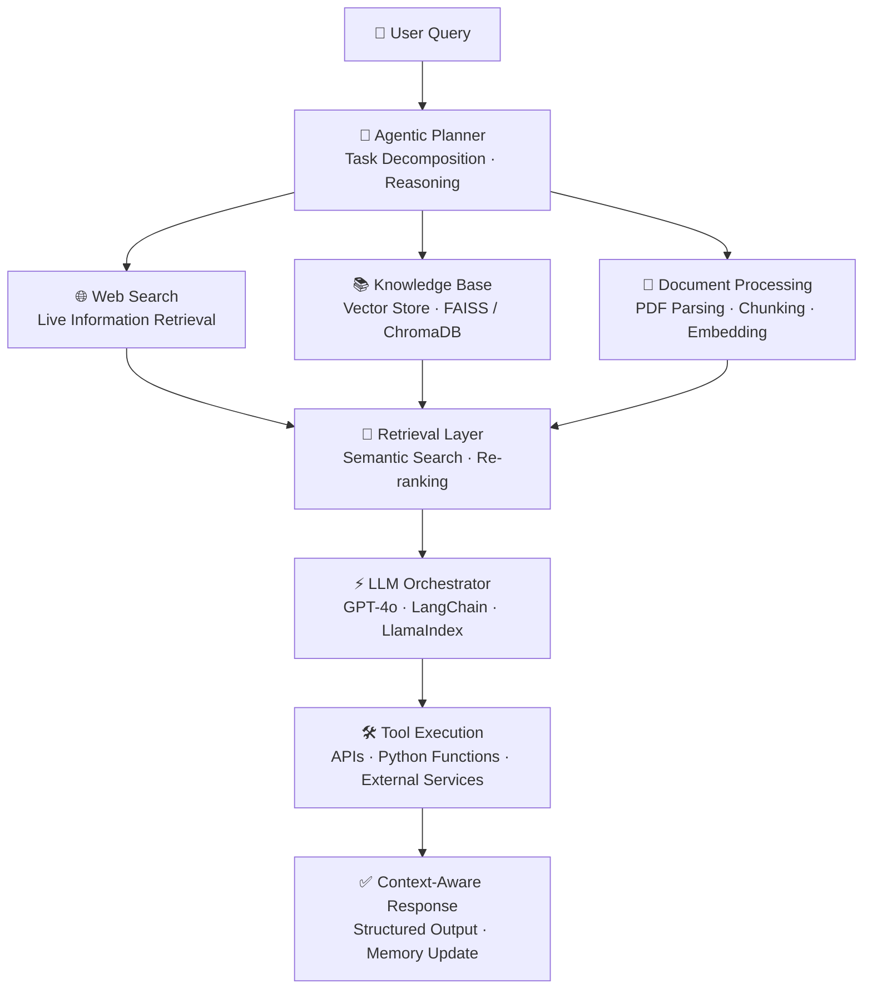
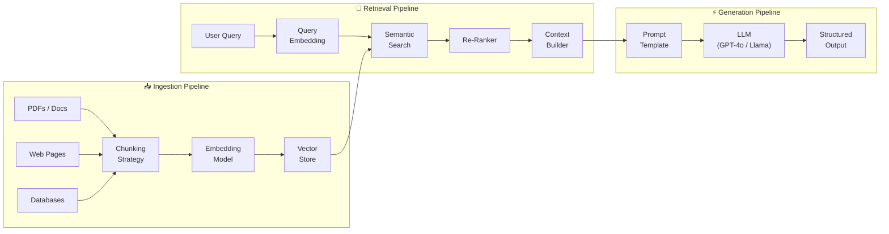
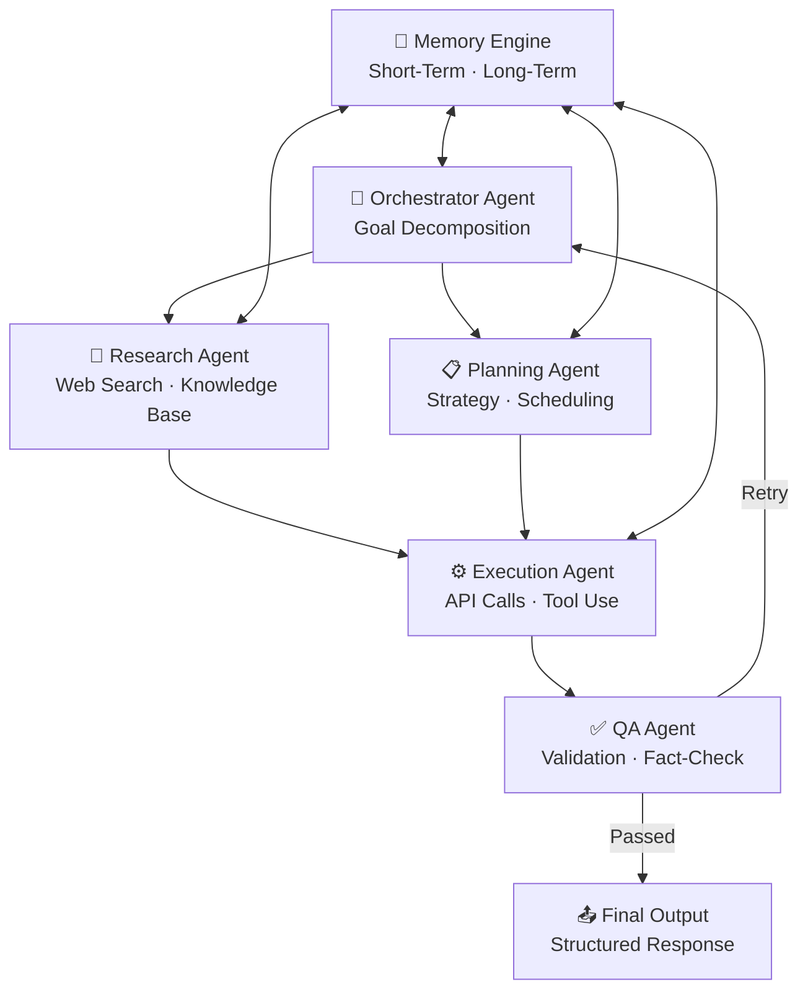
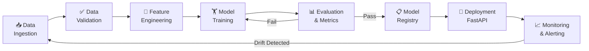

<!-- ============================================================ -->
<!--           MOHIT BARSE — GITHUB PROFILE README                -->
<!--           World-Class AI/ML Engineer Portfolio               -->
<!-- ============================================================ -->


<p align="center">
  <a href="https://readme-typing-svg.demolab.com">
    
  </a>
</p>

<p align="center">
  
  
  
</p>

---

## 🌐 Connect With Me

<p align="center">
  <a href="https://www.linkedin.com/in/mohit-b-9a997b301/">
    
  </a>
  <a href="https://x.com/mohitkb22">
    
  </a>
  <a href="https://github.com/MohitKB22">
    
  </a>
  <a href="mailto:mohitbarse2230@gmail.com">
    
  </a>
</p>

---

## 🧠 About Me


> *"I don't just build models — I build **usable AI systems**."*

I'm an **AI/ML Engineer** at the intersection of **Retrieval-Augmented Generation**, **Agentic AI**, and **scalable backend engineering**. I focus on taking research-grade ideas and shipping them as production-ready applications.

- 🔭 &nbsp;Currently building advanced **RAG pipelines**, **multi-agent systems**, and **multimodal AI** applications
- 🌱 &nbsp;Deepening expertise in **MLOps**, **FastAPI** deployment workflows, and full model lifecycle management
- 🎯 &nbsp;Goal: Own the complete AI pipeline — from data ingestion to deployed, intelligent output
- ✍️ &nbsp;Sharing AI/ML insights on **[X (@mohitkb22)](https://x.com/mohitkb22)**
- 💼 &nbsp;Open to **full-time roles**, **freelance AI projects**, and **research collaborations**
- ⚡ &nbsp;Fun fact: I turn complex, multi-step problems into clean, working solutions

<br clear="right"/>

---

## 🛠️ Tech Stack

### 🤖 AI & Machine Learning

<p align="center">
  
  
  
  
  
  
  
  
  
  
  
  
  
</p>

### ⚙️ Backend Engineering

<p align="center">
  
  
  
  
  
  
</p>

### 🗄️ Databases & Vector Stores

<p align="center">
  
  
  
  
  
  
  
  
</p>

### ☁️ Cloud, DevOps & MLOps

<p align="center">
  
  
  
  
  
  
  
  
  
  
</p>

---

## 🚀 Featured Projects

### ✈️ Agentic AI Travel Planner

> An autonomous multi-agent travel planning system — intelligent task decomposition, live web retrieval, and adaptive itinerary generation powered by LLM orchestration.

| Feature | Details |
|---|---|
| 🧠 Agentic Workflow | Autonomous task decomposition and execution |
| 🌐 Live Retrieval | Real-time web search for up-to-date recommendations |
| 🗺️ Itinerary Engine | Structured travel plans with day-by-day breakdowns |
| ⚙️ Architecture | Multi-agent coordination with planning + execution agents |
| 🛠️ Stack | `LangChain` · `OpenAI` · `Python` · `FastAPI` |
| 📈 Impact | Reduces manual trip planning from hours to seconds |

📦 **Downloads & Links**

[](https://github.com/MohitKB22/AgenticAI-TravelPlanner)
[](https://github.com/MohitKB22/AgenticAI-TravelPlanner/archive/refs/heads/main.zip)

---

### 🩺 AI Health Assistant

> Conversational AI for health guidance — NLP-powered symptom understanding with context-aware responses, safe content guardrails, and real-time suggestion engine.

| Feature | Details |
|---|---|
| 💬 Conversational AI | Health-focused dialogue with memory and context |
| 🔎 Symptom Understanding | NLP-based intent recognition for medical queries |
| 🛡️ Safe Boundaries | Guardrails to route serious cases to professionals |
| 📊 Response Quality | Structured, reliable guidance with clear disclaimers |
| 🛠️ Stack | `JavaScript` · `OpenAI API` · `NLP` · `REST API` |
| 📈 Impact | Accessible health guidance available 24/7 |

📦 **Downloads & Links**

[](https://github.com/MohitKB22/AI_Health_Assitant)
[](https://github.com/MohitKB22/AI_Health_Assitant/archive/refs/heads/main.zip)

---

### 🏎️ F1 Analytics Dashboard

> Interactive analytics platform for Formula 1 race data — driver performance analysis, team trend breakdowns, and lap-by-lap insights with live Plotly visualizations.

| Feature | Details |
|---|---|
| 📊 Visualization | Plotly-powered race charts and driver heatmaps |
| 🏁 Race Analysis | Comparative lap times, sector data, pit strategies |
| ⚡ Interactive UI | Dynamic filters, team/driver selectors, live charts |
| 📦 Data Pipeline | Ingestion from Ergast F1 API + FastF1 library |
| 🛠️ Stack | `Python` · `Streamlit` · `Pandas` · `Plotly` · `FastF1` |
| 📈 Impact | Turns raw race data into actionable performance insights |

📦 **Downloads & Links**

[](https://github.com/MohitKB22/F1-analytics-dashboard)
[](https://github.com/MohitKB22/F1-analytics-dashboard/archive/refs/heads/main.zip)

---

## 🏗️ System Architecture Diagrams

### LLM Orchestration Pipeline


```mermaid
flowchart TD
    A["👤 User Query"]
    B["🧠 Agentic Planner\nTask Decomposition · Reasoning"]
    C1["🌐 Web Search\nLive Information Retrieval"]
    C2["📚 Knowledge Base\nVector Store · FAISS / ChromaDB"]
    C3["📄 Document Processing\nPDF Parsing · Chunking · Embedding"]
    D["🔎 Retrieval Layer\nSemantic Search · Re-ranking"]
    E["⚡ LLM Orchestrator\nGPT-4o · LangChain · LlamaIndex"]
    F["🛠️ Tool Execution\nAPIs · Python Functions · External Services"]
    G["✅ Context-Aware Response\nStructured Output · Memory Update"]

    A --> B
    B --> C1 & C2 & C3
    C1 & C2 & C3 --> D
    D --> E
    E --> F
    F --> G
```

### RAG System Architecture


```mermaid
flowchart LR
    subgraph Ingestion["📥 Ingestion Pipeline"]
        D1["PDFs / Docs"]
        D2["Web Pages"]
        D3["Databases"]
        CH["Chunking\nStrategy"]
        EM["Embedding\nModel"]
        VS["Vector\nStore"]
        D1 & D2 & D3 --> CH --> EM --> VS
    end

    subgraph Retrieval["🔎 Retrieval Pipeline"]
        Q["User Query"]
        QE["Query\nEmbedding"]
        SS["Semantic\nSearch"]
        RR["Re-Ranker"]
        CX["Context\nBuilder"]
        Q --> QE --> SS --> RR --> CX
    end

    subgraph Generation["⚡ Generation Pipeline"]
        PR["Prompt\nTemplate"]
        LM["LLM\n(GPT-4o / Llama)"]
        OP["Structured\nOutput"]
        PR --> LM --> OP
    end

    VS --> SS
    CX --> PR
```

### Multi-Agent Workflow


```mermaid
flowchart TD
    OA["🎯 Orchestrator Agent\nGoal Decomposition"]
    RA["🔎 Research Agent\nWeb Search · Knowledge Base"]
    PA["📋 Planning Agent\nStrategy · Scheduling"]
    EA["⚙️ Execution Agent\nAPI Calls · Tool Use"]
    QA["✅ QA Agent\nValidation · Fact-Check"]
    ME["🧠 Memory Engine\nShort-Term · Long-Term"]
    OUT["📤 Final Output\nStructured Response"]

    OA --> RA & PA
    RA --> EA
    PA --> EA
    EA --> QA
    QA -->|Passed| OUT
    QA -->|Retry| OA
    ME <--> OA & RA & PA & EA
```

### MLOps Pipeline


```mermaid
flowchart LR
    DI["📥 Data\nIngestion"]
    DV["✅ Data\nValidation"]
    FE["🔨 Feature\nEngineering"]
    MT["🏋️ Model\nTraining"]
    EV["📊 Evaluation\n& Metrics"]
    RE["📋 Model\nRegistry"]
    DP["🚀 Deployment\nFastAPI"]
    MO["📈 Monitoring\n& Alerting"]

    DI --> DV --> FE --> MT --> EV -->|Pass| RE --> DP --> MO
    EV -->|Fail| MT
    MO -->|Drift Detected| DI
```

---

## 📊 GitHub Stats

<div align="center">


</div>

<div align="center">
  
</div>

---

## 📈 Contribution Activity

<div align="center">
  
</div>

---

## 🐍 Contribution Snake

<div align="center">
  
</div>

<!-- Snake setup: Create .github/workflows/snake.yml with the YAML below -->

---

## 🏆 GitHub Trophies

<div align="center">
  
</div>

---

## 🎓 Certifications

<div align="center">

| Certification | Platform | Status |
|---|---|---|
| ☁️ AWS Cloud Practitioner | Amazon Web Services | 🔄 In Progress |
| 🤖 Deep Learning Specialization | Coursera / DeepLearning.AI | 🔄 In Progress |
| 🧠 Machine Learning Specialization | Coursera / Andrew Ng | ✅ Completed |
| ⚡ Generative AI with LLMs | DeepLearning.AI | 🔄 In Progress |
| 🔵 Azure AI Fundamentals | Microsoft | 🔄 Planned |

</div>

---

## 🎯 Current Focus

<div align="center">

```
╔══════════════════════════════════════════════════════════╗
║              CURRENT ENGINEERING FOCUS                    ║
╠══════════════════════════════════════════════════════════╣
║  🤖  Multi-Agent Systems   →  Coordinator + tool agents  ║
║  🔎  RAG Optimization      →  Re-ranking + hybrid search ║
║  🏗️  AI Infrastructure     →  Scalable LLM serving       ║
║  🔧  MLOps Pipelines       →  DVC + MLflow + Airflow     ║
║  ⚡  LLM Fine-tuning       →  LoRA / QLoRA techniques    ║
╚══════════════════════════════════════════════════════════╝
```

</div>

---

## 🤝 Open to Collaborate On

<div align="center">

<table>
<tr>
<td align="center" width="25%">

### 🤖 AI Systems
RAG pipelines, LLM applications, agentic workflows, production AI solutions

</td>
<td align="center" width="25%">

### 🛠️ Full-Stack AI
FastAPI backends, vector databases, AI integrations, production deployments

</td>
<td align="center" width="25%">

### 📦 Open Source
AI tooling, developer utilities, automation workflows, community projects

</td>
<td align="center" width="25%">

### ⚡ Innovation
Hackathons, rapid prototyping, research builds, startup ideas

</td>
</tr>
</table>

</div>

---

## 📬 Recruiter Contact Card

<div align="center">

```
┌─────────────────────────────────────────────────────────────┐
│                       MOHIT BARSE                           │
│               AI/ML Engineer · Available Now                │
├─────────────────────────────────────────────────────────────┤
│  📧  mohitbarse2230@gmail.com                               │
│  💼  linkedin.com/in/mohit-b-9a997b301                      │
│  🐦  x.com/mohitkb22                                        │
│  🐙  github.com/MohitKB22                                   │
│  📍  India · Open to Remote & Relocation                    │
├─────────────────────────────────────────────────────────────┤
│  ✅  Full-Time Roles          ✅  Freelance AI Projects     │
│  ✅  Research Collaborations  ✅  Open Source Contributions │
└─────────────────────────────────────────────────────────────┘
```

</div>

---


<div align="center">


<br/><br/>

### ⚡ *"Turning Ideas into Intelligent Systems."*

<br/>


</div>
